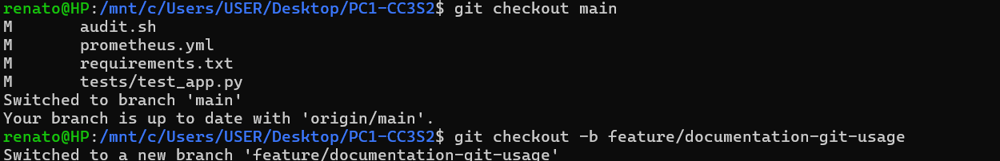
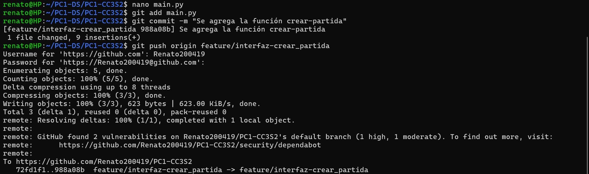
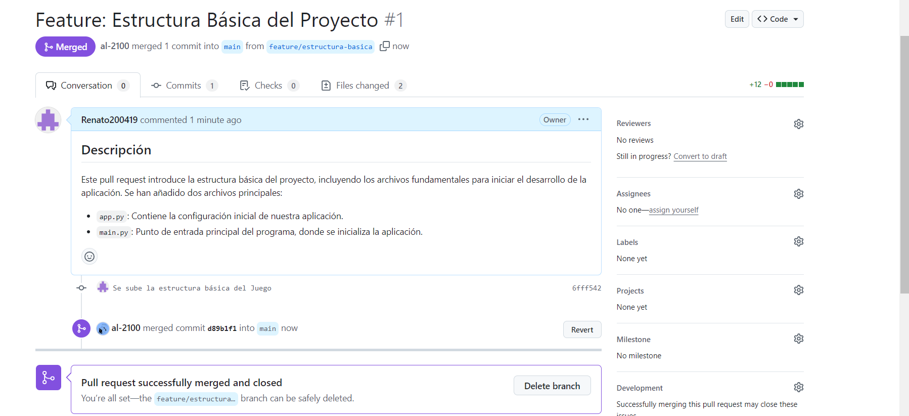
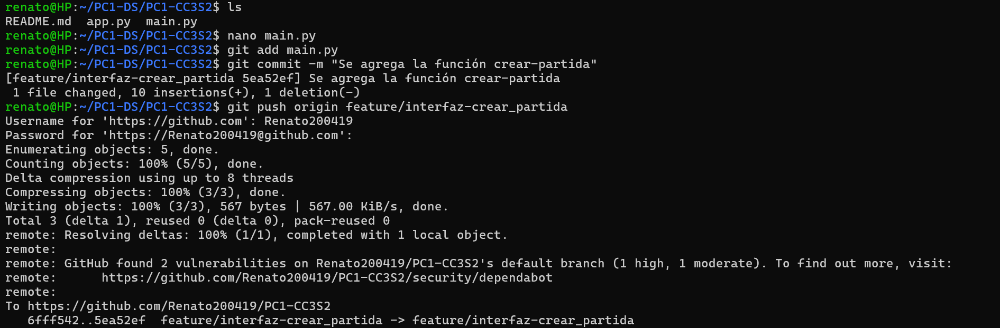
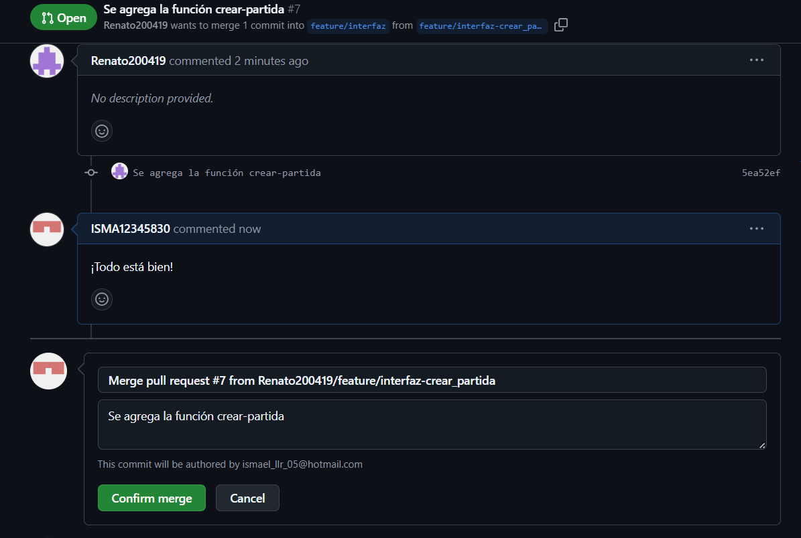
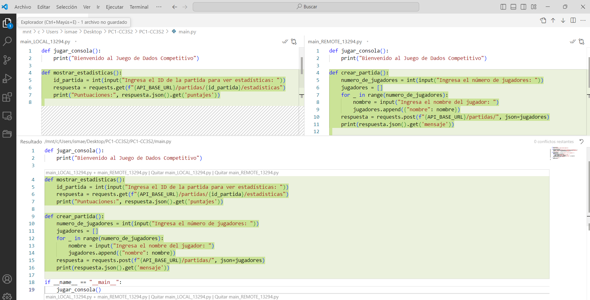
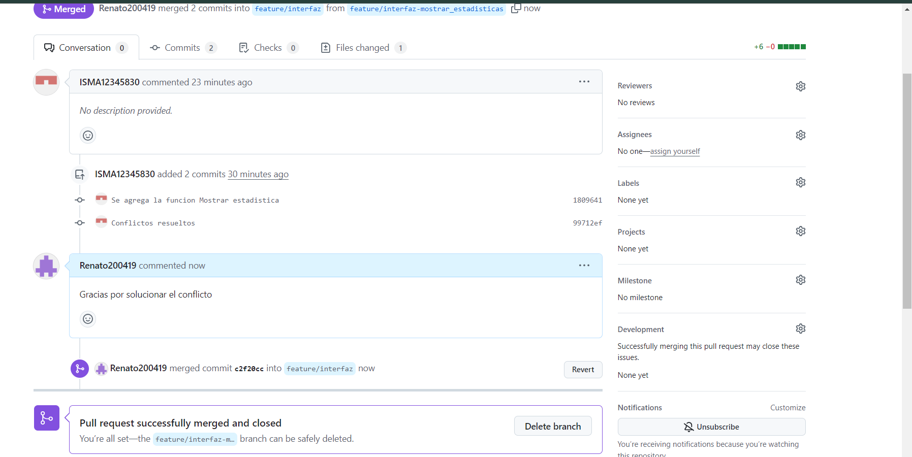

# Índice
1. [API REST](#AP_REST-Juego_de_Dados_Competitivo)
2. [Cliente de Consola](#Documentación-del-Cliente-de-Consola)
3. [DevSecOps](#DevSecOps)
4. [Docker y Contenedores](#Documentación-de-Docker-y-Docker-Compose)
5. [Monitorización y Observabilidad](#Configuración-de-Observabilidad:-Prometheus-y-Grafana)
6. [Uso de Git](#Uso-de-Git-y-Resolución-de-Conflictos-en-el-Proyecto)
7. [Manejo de Branches](#Reporte-Detallado-del-Manejo-de-Branches-en-Orden-Cronológico)


# API REST - Juego de Dados Competitivo

## Propósito
Esta API permite gestionar partidas y jugadores en un juego de dados competitivo. Se pueden registrar jugadores, crear partidas, lanzar dados, y obtener estadísticas de las partidas.
## Endpoints de la API

### 1. **Registrar Jugador**
- **URL**: `/jugadores/`
- **Método**: `POST`
- **Descripción**: Registra un nuevo jugador en el sistema.
- **Solicitud**:
  ```json
  {
    "nombre": "nombre_del_jugador"
  }
  ```
- **Respuesta Exitosa (200)**:
  ```json
  {
    "mensaje": "Jugador nombre_del_jugador registrado con éxito"
  }
  ```
- **Errores**:
  - `400`: El jugador ya está registrado.
  ```json
  {
    "detail": "El jugador ya está registrado"
  }
  ```

### 2. **Crear Partida**
- **URL**: `/partidas/`
- **Método**: `POST`
- **Descripción**: Crea una nueva partida con al menos dos jugadores.
- **Solicitud**:
  ```json
  [
    {"nombre": "jugador1"},
    {"nombre": "jugador2"}
  ]
  ```
- **Respuesta Exitosa (200)**:
  ```json
  {
    "mensaje": "Partida 1 creada con éxito",
    "partida": {
      "id": 1,
      "jugadores": [
        {"nombre": "jugador1"},
        {"nombre": "jugador2"}
      ],
      "puntajes": {
        "jugador1": 0,
        "jugador2": 0
      }
    }
  }
  ```
- **Errores**:
  - `400`: Se requieren al menos 2 jugadores.
  ```json
  {
    "detail": "Se requieren al menos 2 jugadores"
  }
  ```

### 3. **Lanzar Dados**
- **URL**: `/partidas/{partida_id}/lanzar`
- **Método**: `POST`
- **Descripción**: Lanza los dados en la partida y actualiza los puntajes de cada jugador.
- **Parámetros**: 
  - `partida_id` (int): ID de la partida.
- **Respuesta Exitosa (200)**:
  ```json
  {
    "mensaje": "Dados lanzados en la partida 1",
    "puntajes": {
      "jugador1": 4,
      "jugador2": 5
    }
  }
  ```
- **Errores**:
  - `404`: Partida no encontrada.
  ```json
  {
    "detail": "Partida no encontrada"
  }
  ```

### 4. **Obtener Estadísticas**
- **URL**: `/partidas/{partida_id}/estadisticas`
- **Método**: `GET`
- **Descripción**: Obtiene las estadísticas de una partida específica, incluyendo los puntajes de los jugadores.
- **Parámetros**:
  - `partida_id` (int): ID de la partida.
- **Respuesta Exitosa (200)**:
  ```json
  {
    "partida_id": 1,
    "puntajes": {
      "jugador1": 10,
      "jugador2": 15
    }
  }
  ```
- **Errores**:
  - `404`: Partida no encontrada.
  ```json
  {
    "detail": "Partida no encontrada"
  }
  ```

### 5. **Root**
- **URL**: `/`
- **Método**: `GET`
- **Descripción**: Punto de entrada de la API. Devuelve un mensaje de bienvenida.
- **Respuesta Exitosa (200)**:
  ```json
  {
    "message": "Bienvenido al Juego de Dados"
  }
  ```

## Ejemplos de Solicitudes y Respuestas

### Crear Partida
- **Solicitud**:
  ```bash
  curl -X POST "http://localhost:8000/partidas/" -H "Content-Type: application/json" -d '[{"nombre": "jugador1"}, {"nombre": "jugador2"}]'
  ```
- **Respuesta**:
  ```json
  {
    "mensaje": "Partida 1 creada con éxito",
    "partida": {
      "id": 1,
      "jugadores": [
        {"nombre": "jugador1"},
        {"nombre": "jugador2"}
      ],
      "puntajes": {
        "jugador1": 0,
        "jugador2": 0
      }
    }
  }
  ```

### Lanzar Dados
- **Solicitud**:
  ```bash
  curl -X POST "http://localhost:8000/partidas/1/lanzar"
  ```
- **Respuesta**:
  ```json
  {
    "mensaje": "Dados lanzados en la partida 1",
    "puntajes": {
      "jugador1": 4,
      "jugador2": 5
    }
  }
  ```

## Manejo de Errores

- La API devuelve un error `400` si:
  - El jugador ya está registrado.
  - Se intenta crear una partida con menos de dos jugadores.
- La API devuelve un error `404` si:
  - No se encuentra la partida solicitada.

Ejemplo de error:
```json
{
  "detail": "Partida no encontrada"
}
```

## Monitoreo y Métricas

- **Tiradas Totales**: Contador de todas las tiradas realizadas en las partidas. Métrica disponible a través de Prometheus (`tiradas_totales`).
- **Latencia de la API**: Histograma que mide la latencia de la API en segundos (`latencia_api`).

## Ejecución de la API

Para ejecutar la API, asegúrate de tener `uvicorn` instalado y corre el siguiente comando:

```bash
uvicorn main:app --reload
```

Esto iniciará la aplicación en `http://localhost:8000` y expondrá las métricas en `http://localhost:8000/metrics`.


Aquí tienes la sección de ejecución de la API con la explicación de las clases, cómo se almacenan los datos, y el propósito de cada dependencia:
## Explicación de las Clases y Almacenamiento de Datos

### Clases Definidas

- **Jugador (BaseModel)**:
  Representa un jugador con un solo atributo:
  - `nombre`: El nombre del jugador, de tipo `str`.

  Ejemplo:
  ```json
  {
    "nombre": "Juan"
  }
  ```

- **Partida (BaseModel)**:
  Representa una partida de dados con tres atributos:
  - `id`: Un identificador único para la partida, de tipo `int`.
  - `jugadores`: Una lista de jugadores registrados para la partida.
  - `puntajes`: Un diccionario que asigna el nombre del jugador a su puntaje actual.

  Ejemplo:
  ```json
  {
    "id": 1,
    "jugadores": [
      {"nombre": "Juan"},
      {"nombre": "Pedro"}
    ],
    "puntajes": {
      "Juan": 0,
      "Pedro": 0
    }
  }
  ```

### Almacenamiento de Datos

La API utiliza dos listas en memoria para almacenar la información de jugadores y partidas:

- **`jugadores_registrados`**: Lista donde se almacenan todos los jugadores registrados. Cada elemento es una instancia de la clase `Jugador`.
- **`partidas`**: Lista donde se almacenan las partidas creadas. Cada elemento es una instancia de la clase `Partida`, que incluye la lista de jugadores y sus puntajes.

Ejemplo de contenido:
```python
jugadores_registrados = [Jugador(nombre="Juan")]
partidas = [
    Partida(
        id=1,
        jugadores=[Jugador(nombre="Juan"), Jugador(nombre="Pedro")],
        puntajes={"Juan": 0, "Pedro": 0}
    )
]
```

### Manejo de Estado

Los datos se mantienen en la memoria del servidor mientras la aplicación esté en ejecución. Si el servidor se reinicia, los datos se perderán, ya que no se usa una base de datos persistente, este problema se puede abordar en otra versión de nuestro proyecto. 

---

## Explicación de las Dependencias

- **FastAPI**: Framework web para construir APIs rápidas y sencillas con Python, soporta validación automática de datos y documentación de API integrada (Swagger y OpenAPI).

- **Pydantic**: Se utiliza para definir modelos de datos (como `Jugador` y `Partida`) con validación automática. Cada modelo hereda de `BaseModel` de Pydantic, lo que facilita el manejo y validación de datos.

- **Uvicorn**: Un servidor ASGI liviano que permite ejecutar aplicaciones FastAPI. El comando `uvicorn main:app --reload` inicia el servidor de desarrollo y activa la recarga automática cuando se detectan cambios en el código.

- **Prometheus FastAPI Instrumentator**: Instrumenta la API para monitoreo, permitiendo capturar métricas como el número de tiradas de dados y la latencia de las solicitudes. Las métricas se exponen en el endpoint `/metrics`.

- **Prometheus Client (Counter, Histogram)**: 
  - `Counter`: Contador para registrar el número total de tiradas de dados.
  - `Histogram`: Registro de la latencia de las solicitudes HTTP a la API.
- **Random**: Se utiliza para generar tiradas de dados aleatorias en el rango de 1 a 6 para cada jugador.

---

# Documentación del Cliente de Consola
## Propósito
Este documento proporciona una guía detallada sobre cómo instalar, ejecutar y utilizar el cliente de consola para el juego de dados competitivo. El cliente permite a los jugadores unirse a partidas, lanzar dados y consultar estadísticas a través de la terminal.
## Instrucciones de Instalación y Ejecución
### Requisitos Previos
- **Python**: Debe estar instalado en tu sistema (versión 3.x recomendada).
- **Dependencias**: Asegúrate de tener las dependencias del proyecto especificadas en `requirements.txt`.
### Instalación
1. **Clonar el Repositorio**: Si aún no lo has hecho, clona el repositorio del proyecto:
   ```bash
   git clone https://github.com/usuario/juego-dados-competitivo.git
   ```
2. **Navegar al Directorio del Proyecto**:
   ```bash
   cd juego-dados-competitivo
   ```
3. **Instalar Dependencias**: Instala las dependencias necesarias:
   ```bash
   pip install -r requirements.txt
   ```
### Ejecución
Para iniciar el cliente de consola y comenzar a jugar:
1. **Ejecutar el Cliente**:
   ```bash
   python game_console.py
   ```
## Guía de Uso
### Unirse a una Partida
1. Al iniciar el cliente, se te pedirá ingresar tu nombre y el nombre de la partida a la que deseas unirte.
2. Introduce los datos solicitados y presiona Enter.
### Lanzar Dados
1. Dentro de una partida, puedes lanzar los dados utilizando el comando de lanzamiento cuando se te indique.
2. El cliente mostrará el resultado del lanzamiento y actualizará la puntuación.
### Ver Estadísticas
1. Para consultar las estadísticas de la partida actual, utiliza el comando correspondiente en el cliente.
2. El cliente te proporcionará información sobre la puntuación actual y otras métricas relevantes.
## Ejemplos de Uso
### Unirse a una Partida
```
> python main.py
Ingrese su nombre: Juan
Ingrese el nombre de la partida: Partida1
```
### Lanzar Dados
```
> lanzar dados
Resultado: 4, 5
```
### Ver Estadísticas
```
> ver estadísticas
Puntuación Actual: 9
```
## Solución de Problemas
- **No se puede conectar al servidor**: Verifica que los servicios de la API estén funcionando y que tu red esté correctamente configurada.
- **Errores de dependencia**: Asegúrate de haber instalado todas las dependencias mencionadas en `requirements.txt`.

---

# DevSecOps

## Propósito

El propósito de esta documentación es explicar cómo se ha implementado DevSecOps en el proyecto, integrando prácticas de desarrollo, seguridad y operaciones (DevSecOps) para asegurar que el ciclo de vida del software sea seguro, eficiente y automatizado. Se detalla cómo la seguridad se integra en cada fase del pipeline de CI/CD, desde la instalación de dependencias hasta la auditoría de vulnerabilidades.

## 1. Configuración de análisis de seguridad

### Herramientas de auditoría

Para garantizar la seguridad del código, se ha integrado la siguiente herramienta en el pipeline CI/CD:

- **pip-audit**: Una herramienta que audita las dependencias del proyecto para detectar vulnerabilidades conocidas en paquetes de Python.

Esta herramienta se ejecuta automáticamente cada vez que se realizan cambios en el código, alertando al equipo si existen vulnerabilidades que podrían poner en riesgo el proyecto.

### Ejecución de auditorías de seguridad

La auditoría de seguridad se realiza a través de la herramienta **pip-audit** en el pipeline de GitHub Actions. Esta herramienta analiza las dependencias en el archivo `requirements.txt` para identificar cualquier vulnerabilidad conocida:

```bash
pip-audit
```

Cada vez que se realiza un push o pull request en la rama `main`, el pipeline CI/CD ejecuta esta auditoría. En caso de encontrar una vulnerabilidad, el pipeline falla, alertando a los desarrolladores para que solucionen el problema antes de proceder con el despliegue.

Ejemplo de como **pip-audit** detecta vulnerabilidades y falla el pipeline:
- Alerta en el pipeline:
	
	![[pip-audit.png]](Imagenes/pip-audit.png)
	
- Medidas tomadas:
	
	![[medidas.png]](Imagenes/medidas.png)

---

## 2. Configuración de GitHub Actions para CI/CD

El archivo `ci.yml` define las diferentes etapas del pipeline DevSecOps. Este es el código de `ci.yml` que fue construyendose poco a poco a lo largo de nuestro proyecto:

```yaml
name: CI/CD Pipeline

on:
  push:
    branches:
      - main
  pull_request:
    branches:
      - main

jobs:
  build:
    runs-on: ubuntu-latest

    steps:
      - name: Checkout code
        uses: actions/checkout@v2

      - name: Set up Python
        uses: actions/setup-python@v3
        with:
          python-version: '3.8'

      - name: Install dependencies
        run: |
          python -m pip install --upgrade pip
          pip install --upgrade setuptools
          pip install -r requirements.txt

      - name: Run tests
        env:
          PYTHONPATH: .
        run: |
            pytest tests/

      - name: Install pip-audit
        run: pip install pip-audit

      - name: Audit dependencies
        run: pip-audit

      - name: Build Docker image
        run: docker build -t juego-dados-competitivo .

      - name: Run Docker container
        run: docker run -d -p 8000:8000 juego-dados-competitivo

      - name: Wait for FastAPI to be ready
        run: |
          until curl -s http://localhost:8000/; do
            echo "Esperando a que FastAPI esté disponible..."
            sleep 5
          done
```

Este archivo de pipeline realiza las siguientes tareas:

1. **Checkout del código**: Descarga el código desde el repositorio de GitHub.
2. **Instalación de Python**: Configura el entorno de Python en la versión 3.8.
3. **Instalación de dependencias**: Instala las dependencias del proyecto especificadas en `requirements.txt`.
4. **Ejecución de pruebas**: Ejecuta los tests automáticos definidos en el directorio `tests/` utilizando `pytest`.
5. **Auditoría de dependencias con `pip-audit`**: Ejecuta la herramienta `pip-audit` para identificar posibles vulnerabilidades en las dependencias del proyecto.
6. **Construcción de imagen Docker**: Construye una imagen Docker para la aplicación.
7. **Despliegue en Docker**: Inicia un contenedor Docker con la aplicación FastAPI.
8. **Espera de FastAPI**: Espera hasta que el servidor FastAPI esté disponible.

---
## 3. Instrucciones para ejecutar auditorías de seguridad manualmente

Si deseas ejecutar la auditoría de seguridad de forma manual sin esperar a que se active el pipeline CI/CD, sigue estos pasos:

1. Asegúrate de tener **pip-audit** instalado:
   
   ```bash
   pip install pip-audit
   ```

2. Ejecuta la auditoría de seguridad con el siguiente comando:

   ```bash
   pip-audit
   ```

Esto generará un informe que detallará cualquier vulnerabilidad detectada en las dependencias del proyecto. En caso de encontrar alguna, actualiza las dependencias afectadas o considera opciones alternativas que sean más seguras.

---

## 4. Reflexión sobre el impacto del Sec en DevSecOps

La inclusión de **seguridad** en el pipeline (Sec en DevSecOps) asegura que el software no solo sea funcional, sino también seguro desde las primeras etapas del desarrollo. Al integrar **pip-audit** en el pipeline CI/CD, hemos logrado un enfoque proactivo para la seguridad. Esto significa que cualquier vulnerabilidad en las dependencias será detectada y reportada antes de que el código se despliegue en producción, permitiendo que el equipo reaccione rápidamente.

Este enfoque mejora significativamente la postura de seguridad del proyecto, ya que permite identificar y remediar problemas de seguridad antes de que afecten al usuario final.

---

### 5. Reflexión final sobre el flujo de trabajo DevSecOps

El enfoque DevSecOps utilizado en este proyecto combina desarrollo, seguridad y operaciones de manera efectiva, asegurando que todas las etapas del ciclo de vida del software se gestionen de forma automatizada y segura. Los beneficios principales de esta implementación han sido:

- **Automatización**: Nos ha permitido reducir el tiempo necesario para realizar pruebas y auditorías, y eliminar tareas repetitivas.
- **Seguridad proactiva**: Las vulnerabilidades se detectan y gestionan automáticamente antes de que lleguen a producción.
- **Entrega continua**: El uso de Docker facilita la consistencia entre los entornos de desarrollo y producción, lo que acelera la entrega de nuevas versiones del software.

El flujo DevSecOps asegura una entrega continua con altos estándares de seguridad y eficiencia, lo que no solo mejora la calidad del software, sino que también incrementa la confianza del equipo y de los usuarios en el producto final.


---

# Documentación de Docker y Docker Compose
## Introducción
En este proyecto utilizamos Docker y Docker Compose para contenerizar la aplicación del juego de dados, así como los servicios adicionales de Prometheus y Grafana para monitoreo. Esto permite una fácil configuración y ejecución de todos los servicios necesarios en un entorno controlado y replicable.
## Estructura de los Servicios
El proyecto contiene los siguientes servicios dentro de contenedores:
- **app**: Contenedor que ejecuta la API REST del juego de dados desarrollada en Python usando FastAPI.
- **prometheus**: Contenedor que ejecuta Prometheus para recolectar métricas de la API.
- **grafana**: Contenedor que ejecuta Grafana para visualizar las métricas recolectadas por Prometheus.

## Pasos que se realizaron:
1. Al iniciar el repositorio se creó la rama `feature/estructura-básica` en el cual se agregó el Dockerfile.
### Dockerfile
```bash
# Usamos la imagen base de Python 3.8
FROM python:3.8
# Copiamos el contenido del directorio 'app' en el contenedor en la ruta '/app'
COPY ./app /app
# Establecemos el directorio de trabajo en '/app'
WORKDIR /app
# Instalamos las dependencias necesarias: FastAPI y Uvicorn
RUN pip install fastapi uvicorn
# Comando para ejecutar la aplicación con Uvicorn
CMD ["uvicorn", "app:app", "--host", "0.0.0.0", "--port", "8000"]
```

2. Luego se hizo una modificación en la línea de COPY en la misma rama:

```bash
# Copiamos todos los archivos del directorio actual al contenedor en la ruta '/app'
COPY . /app
```
3. También se agrega la estructura básica del docker-compose.yml:
```bash
version: '3.8'  # Usa la versión 3.8 de Docker Compose
services:
  app:  # Nombre del servicio
    build: .  # Construye la imagen a partir del Dockerfile en el directorio actual
    ports:
      - "8000:8000"  # Mapea el puerto 8000 del contenedor al puerto 8000 del host
    environment:
      - ENVIRONMENT=production  # Define una variable de entorno
    volumes:
      - .:/app  # Monta el directorio actual en '/app' dentro del contenedor
    command: uvicorn app:app --host 0.0.0.0 --port 8000  # Comando para ejecutar la aplicación
```
4. Posteriormente modificamos el docker-compose.yml en el cual se incluye la configuración de Prometheus y Grafana:

```bash
version: '3.8'

services:
  app:
    build: .  # Construye la imagen desde el Dockerfile en el directorio actual
    ports:
      - "8000:8000"  # Mapea el puerto 8000 del contenedor al puerto 8000 del host
    environment:
      - ENVIRONMENT=production  # Establece la variable de entorno para indicar que es producción
    volumes:
      - .:/app  # Monta el directorio actual en /app dentro del contenedor
    command: uvicorn app:app --host 0.0.0.0 --port 8000  # Comando para iniciar la aplicación usando Uvicorn

  prometheus:
    image: prom/prometheus  # Utiliza la imagen oficial de Prometheus
    volumes:
      - ./prometheus.yml:/etc/prometheus/prometheus.yml  # Monta el archivo de configuración de Prometheus
    ports:
      - "9090:9090"  # Mapea el puerto 9090 del contenedor al puerto 9090 del host
    depends_on:
      - app  # Asegura que el servicio 'app' esté en ejecución antes de iniciar Prometheus

  grafana:
    image: grafana/grafana  # Utiliza la imagen oficial de Grafana
    ports:
      - "3000:3000"  # Mapea el puerto 3000 del contenedor al puerto 3000 del host
    depends_on:
      - prometheus  # Asegura que Prometheus esté en ejecución antes de iniciar Grafana
    environment:
      - GF_USERS_ALLOW_SIGN_UP=false  # Desactiva el registro de nuevos usuarios

volumes:
  grafana_data:
    driver: local  # Define un volumen local para almacenar datos de Grafana
```

5. Se hizo cambios en `requirements.txt` ya que se presentó un error en la compilación del main.py
```bash
fastapi~=0.115.0
uvicorn~=0.22.0
pydantic~=2.9.2
pip-audit
pytest
httpx

prometheus_client~=0.21.0
prometheus-fastapi-instrumentator
requests~=2.32.3
```
6. Luego modificamos el Dockerfile añadiendo `requirements.txt` para actualizar la forma en la que se instalan las dependencias:
```bash
# Usamos la imagen base de Python 3.8
FROM python:3.8

# Copiamos todos los archivos del directorio actual al contenedor en la ruta '/app'
COPY . /app

# Establecemos el directorio de trabajo en '/app'
WORKDIR /app
COPY requirements.txt ./

# Instalamos las dependencias necesarias: FastAPI y Uvicorn
RUN pip install --no-cache-dir -r requirements.txt

# Comando para ejecutar la aplicación con Uvicorn
CMD ["uvicorn", "app:app", "--host", "0.0.0.0", "--port", "8000"]
```

7. Finalmente actualizamos el docker-compose.yml en el cual se modifica para mantener los datos intactos:
```bash
version: '3.8'

services:
  app:
    build: .  # Construye la imagen desde el Dockerfile en el directorio actual
    ports:
      - "8000:8000"  # Mapea el puerto 8000 del contenedor al puerto 8000 del host
    environment:
      - ENVIRONMENT=production  # Establece la variable de entorno para indicar que es producción
    volumes:
      - .:/app  # Monta el directorio actual en /app dentro del contenedor
    command: uvicorn app:app --host 0.0.0.0 --port 8000  # Comando para iniciar la aplicación usando Uvicorn

  prometheus:
    image: prom/prometheus  # Utiliza la imagen oficial de Prometheus
    volumes:
      - ./prometheus.yml:/etc/prometheus/prometheus.yml  # Monta el archivo de configuración de Prometheus
      - prometheus_data:/prometheus  # Almacena datos de series temporales aquí
    ports:
      - "9090:9090"  # Mapea el puerto 9090 del contenedor al puerto 9090 del host
    depends_on:
      - app  # Asegura que el servicio 'app' esté en ejecución antes de iniciar Prometheus

  grafana:
    image: grafana/grafana  # Utiliza la imagen oficial de Grafana
    volumes:
      - grafana_data:/var/lib/grafana  # Persiste datos de Grafana aquí
    ports:
      - "3000:3000"  # Mapea el puerto 3000 del contenedor al puerto 3000 del host
    depends_on:
      - prometheus  # Asegura que Prometheus esté en ejecución antes de iniciar Grafana
    environment:
      - GF_USERS_ALLOW_SIGN_UP=false  # Desactiva el registro de nuevos usuarios

volumes:
  grafana_data:
    driver: local  # Define un volumen local para almacenar datos de Grafana
  prometheus_data:
    driver: local  # Define un volumen local para almacenar datos de Prometheus
```
## Ejecución del Proyecto con Docker Compose

### 1. Iniciar los Servicios
Para iniciar todos los servicios (API, Prometheus y Grafana), ejecutar el siguiente comando:
```bash
docker-compose up --build
```
### 2. Detener los Servicios
Para detener todos los servicios, usar:
```bash
docker-compose down
```

### 3. Reconstruir los Contenedores
Si se realiza cambios en el código o en las configuraciones, usamos el mismo comando del paso 1 para  reconstruir los contenedores con:

```bash
docker-compose up --build
```
### 4. Verificar los Contenedores Corriendo
Para verificar que todos los contenedores están corriendo:

```bash
docker ps
```

## Acceso a los Servicios
Una vez que los contenedores estén en funcionamiento, podemos acceder a los servicios en los siguientes enlaces:

- **API del Juego**: [http://localhost:8000](http://localhost:8000)
- **Prometheus**: [http://localhost:9090](http://localhost:9090)
- **Grafana**: [http://localhost:3000](http://localhost:3000)

## Uso de Volúmenes
Para asegurar que los datos de Grafana y Prometheus no se pierdan entre reinicios de contenedores, se configuraron los siguientes volúmenes.

### 1. Volumen de Grafana
- **`grafana_data`**: Se utiliza para almacenar los dashboards y configuraciones de Grafana.
```yaml
volumes:
  grafana_data:
    driver: local
```
### 2. Volumen de Prometheus
`prometheus_data`: Almacena los datos históricos de métricas recolectadas por Prometheus.
 ```yaml
volumes:
  prometheus_data:
    driver: local
 ```
## Finalización con `pull request` y la aceptación del `merge`
1. Al subir los cambios en la rama, se hace un `Compare & pull request`
2. Se añade un título y una descripción breve.
3. Luego se agrega un comentario avisando que estás esperando la aceptación de los cambios. [optional]
4. Uno de los colaboradores acepta nuestros cambios.


---

# Configuración de Observabilidad: Prometheus y Grafana
## Introducción
En este proyecto, se utiliza Prometheus para recolectar métricas de la API REST del juego de dados, y Grafana para visualizar esas métricas. La monitorización nos permite rastrear el comportamiento de la API y detectar posibles problemas de rendimiento o errores, como latencia alta o un número inesperado de tiradas de dados.

## Métricas Monitoreadas

Se están monitoreando varias métricas clave del juego de dados y del rendimiento de la API:

### 1. **Métricas Personalizadas**
- **tiradas_totales_total**: Contador que registra el número total de tiradas de dados realizadas en el juego.
- **latencia_api**: Histograma que mide la latencia de las solicitudes a la API REST en segundos.

### 2. **Métricas Estándar (Prometheus FastAPI Instrumentation)**
- **http_requests_total**: Número total de solicitudes HTTP realizadas a la API, desglosadas por método y estado HTTP.
- **process_resident_memory_bytes**: Uso de memoria del proceso.
- **process_cpu_seconds_total**: Tiempo total de CPU consumido por el proceso.

## Configuración de Prometheus

El archivo `prometheus.yml` contiene la configuración para que Prometheus raspe las métricas de la API del juego.

### Archivo `prometheus.yml`:
```yaml
global:
  scrape_interval: 15s  # Frecuencia con la que Prometheus raspa las métricas

scrape_configs:
  - job_name: 'py-app'  # Nombre del trabajo de monitoreo
    static_configs:
      - targets: ['app:8000']  # API del juego ejecutándose en el puerto 8000
```
Para acceder a Prometheus nos dirigimos a [http://localhost:9090](http://localhost:9090).
## Configuración de Grafana

Grafana se utiliza para visualizar las métricas recolectadas por Prometheus. Hemos configurado varios dashboards que muestran información clave sobre la aplicación.

### 1. **Importación de Dashboards**
- Los dashboards preconfigurados están en la carpeta `metrics_dashboards/`.
- Para importar un dashboard en Grafana:
  1. Acceder a Grafana en [http://localhost:3000](http://localhost:3000).
  2. Ir a `Dashboards` > `Manage` > `Import`.
  3. Seleccionar el archivo JSON desde `metrics_dashboards/` y seguir las instrucciones para configurar la fuente de datos.

## Consultas en Grafana

A continuación se muestran algunas consultas comunes que se pueden utilizar en Grafana para visualizar las métricas recolectadas por Prometheus.

### 1. **Tiradas Totales (tiradas_totales_total)**
- Consulta para visualizar el número total de tiradas de dados en el último minuto:
```promql
increase(tiradas_totales_total[1m])
```
### 2. Latencia de la API (latencia_api)
Consulta para ver la latencia promedio de la API:
```promql
rate(latencia_api_sum[1m]) / rate(latencia_api_count[1m])
```
## Pasos que se realizaron en grafana y tambi:
1. Luego de usar el comando: `docker-compose up --build -d`, abrimos el enlace: [http://localhost:3000] y nos logeamos como: `admin` tanto en usuario como contraseña.

2. De igual manera al ingrear link de Prometheus: 

3. Estando en Grafana nos dirigimos a Dashboards y configuramos una nueva `data source` que en este caso sería Prometheus lo configuramos


4. Importamos un dashboard llamado Métricas y luego agregamos un query para el panel: Latencia

5. Luego se duplicó el panel en el cual esta vez lo configuramos llamandolo: Tiradas_totales
 
6. Entonces en main.py se jugaría una partida y se tiraría los dados. Finalmente vemos los cambios
 
 
7. También se pudo visualizar en Prometheus, dando clic en `open metrics explorer` y luego se ejecuta.
 
8. Para finalizar se importó el dashboard y se agregó a la rama.

## Finalización con `pull request` y la aceptación del `merge`
1. Al subir los cambios en la rama, se hace un `Compare & pull request`
2. Se añade un título y una descripción breve.
3. Luego se agrega un comentario avisando que estás esperando la aceptación de los cambios. [optional]
4. Uno de los colaboradores acepta nuestros cambios.


---

# Uso de Git y Resolución de Conflictos en el Proyecto

## Introducción
Git es la herramienta principal utilizada para el control de versiones en este proyecto. A través de Git, gestionamos los cambios en el código, colaboramos de manera eficiente entre diferentes desarrolladores y resolvemos conflictos de fusión cuando múltiples personas trabajan en los mismos archivos.

Este documento describe el flujo de trabajo con Git, cómo resolver conflictos de manera efectiva utilizando `git mergetool`, y proporciona ejemplos de resolución de conflictos que han ocurrido durante el desarrollo.

## Flujo de Trabajo con GitHubFlow
El proyecto sigue el GitHub Flow, un flujo de trabajo ligero y flexible que facilita el desarrollo colaborativo y continuo. GitHub Flow se basa en ramas (`branches`) y Pull Requests (PRs) para gestionar el ciclo de vida de las características y correcciones de errores de manera eficiente.

### 1. Estructura del Flujo de Trabajo (GitHub Flow)
El flujo de trabajo seguido en este proyecto tiene los siguientes pasos:

**Nota se añaden imágenes como ejemplos:**

#### 1. Rama Principal (main):
- La rama main siempre contiene el código estable y listo para producción.
- Todos los cambios nuevos deben pasar por una revisión antes de fusionarse en main.
#### 2. Crear una Rama de Funcionalidad (Feature Branch):
- Cada nueva funcionalidad o corrección se desarrolla en su propia rama.
- Para empezar a trabajar en una nueva funcionalidad, primero se crea una nueva rama desde `main`:
Ejemplo: 

```bash
git checkout -b feature/nueva-funcionalidad
```
**Foto ejemplo:**

#### 3. Hacer Commits en la Nueva Rama:
Se realiza commits pequeños y significativos a medida que se desarrolla la nueva funcionalidad o la corrección de errores:
```bash
git add .
git commit -m "Se implementa la nueva funcionalidad X"
```
**Foto ejemplo:**

#### 4. Abrir un Pull Request (PR):
- Una vez que la nueva funcionalidad esté lista, abrimos un PR desde la rama que se ha creado hacia main. Y agregamos una descripción breve junto con su título.
- Esto permite que otros miembros del equipo revisen los cambios antes de fusionarlos.


#### 5. Revisión y Fusión (Merge):
- El PR debe ser revisado por al menos un colaborador.
- Después de ser aprobado y si no hay conflictos, el PR se fusiona en main:


**Resultado Final**


#### 6- Despliegue a Producción:
Como main siempre contiene código listo para producción, cualquier cambio fusionado en `main` puede ser desplegado inmediatamente.


### 2. Gráfico de Red (Network Graph)
El siguiente gráfico muestra cómo se ha desarrollado el proyecto utilizando GitHub Flow, con múltiples ramas de funcionalidad y fusiones (Pull Requests) en la rama main.


Cada línea representa una rama de funcionalidad o corrección de errores que se desarrolló de manera independiente antes de fusionarse en main.
Los puntos representan commits realizados a lo largo del tiempo, mientras que los bloques de fusión muestran cuándo las ramas fueron fusionadas en main.


### 3. Ventajas de GitHub Flow
GitHub Flow es ideal para este proyecto porque:

- **Flujo ligero**: Es simple y fácil de seguir, adecuado para un ciclo de desarrollo continuo.
- **Despliegue frecuente**: Permite despliegues frecuentes, ya que cualquier cambio en main está listo para producción.
- **Revisión colaborativa**: Los Pull Requests facilitan la colaboración y aseguran que el código sea revisado antes de ser fusionado.

### 4. Resolución de Conflictos usando `git mergetool`
En ocasiones, dos o más desarrolladores pueden trabajar en partes similares del código, lo que provoca conflictos de fusión. Para resolver estos conflictos, se hicieron los siguientes. Primero se mostrará como trabajaron diferentes colaboradores en dos ramas distintas partiendo de una rama principal y se resolverá el conflicto:
**Pasos que se realizaron:**
1. A partir de la rama `main` se creó la rama `feature/interfaz` y luego se crearon dos ramas a partir de esa rama:
2. El colaborador A crea la rama `feature/interfaz-crear_partida` a partir de `feature/interfaz`. Además, realizó cambios como agregar la función `crear_partida` en `main.py`.

3. El colaborador B crea la rama `feature/interfaz-mostrar_estadisticas` a partir de `feature/interfaz`. Además, realizó cambios como agregar la función `mostrar_estadisticas` en `main.py`.

4. Luego de que cada colaborador hace un `git push origin <nombre de la rama respectiva>`. El colaborador A crear un pull request. Agrega un título y breve descripción (en caso sea necesario).


    
5. El colaborador B acepta el PR y se realiza la fusión.


    
6. Ahora el colaborador B intentará realizar un PR agregando su título y una breve descripción (en caso sea necesario).

7. El colaborador B se encontrará con este conflicto y tendrá que solucionarlo.

8. El colaborador B actualiza su rama `feature-interfaz` con el comando `git pull origin feature-interfaz ` con los últimos cambios. Y se encontrará con el conflicto.

9. Para solucionar usa el comando `git mergetool`que resolverá conflictos de fusión de manera visual con la ayuda de Visual Studio Code.

10. El Visual Studio Code se abrirá automáticamente y podrá ver el conflicto:

11. El colaborador B soluciona uniendo ambos cambios y eso se hace dando clic en el botón `✔✔` tanto en la izquierda como derecha para aceptar ambos cambios.

12. Una vez terminado de resolver el conflicto, se realiza el commit y el push.

13. Finalmente el colaborador A acepta el PR y se realizaría la fusión con éxito



## Uso de cherry-pick
La situación que enfrentamos para utilizar cherry-pick fue la siguiente:

Se creó la rama `feature/metrics` para configurar las métricas de Prometheus, en un momento se vió que era necesario actualizar la forma en la que el Dockerfile instalaba las dependencias, por lo que se creó una rama más a partir de `feature/metrics` llamada `feature/metrics-docker-update`.

Al terminar los cambios en `feature/metrics-docker-update`, se procedió a crear la PR y fusionar.

![[PR17.png]](Imagenes-git/PR17.png)

Aquí tuvimos un error pues la PR solicitaba fusionar `feature/metrics-docker-update` con `main` y al darnos cuenta creamos otra PR haciendo la fusión correcta de `feature/metrics-docker-update` a `feature/metrics` y posterior a ello se fusiona `feature/metrics` con `main`.

![[PR18.png]](Imagenes-git/PR18.png)

![[PR19.png]](Imagenes-git/PR19.png)

Luego de estos PR se procede a revertir el merge de `feature/metrics-docker-update` con `main`. El error se da aquí, pues revertir la PR 17 (la del merge erróneo) luego de aceptar la PR-18 y PR-19 elimina cambios que ya no se incluyen en las últimas PR porque se supone que fueron incluidos antes.

Ahora tenemos la rama main sin varios commits relevantes, una solución rápida que se nos ocurrió es utilizar `cherry-pick` para traer esos cambios a `main`. A continuación la PR que resuelve el problema:

![[PR20.png]](Imagenes-git/PR20.png)

El integrante Olivera se da cuenta de un problema con nuestro Pipeline tras traer estos commits:

![[Problema.png]](Imagenes-git/Problema.png)

El integrante Barriga lee el comentario y tras analizar la causa de que la API no responda, se da cuenta que falta hacer un `cherry-pick` a un commit más. Se hace los cambios y se aprueba la PR ahora que sí funciona.

![[solucion.png]](Imagenes-git/solucion.png)

Con esto nuestro gráfico de las ramas se ve así:

![[branches.png]](Imagenes-git/branches.png)

---

# Reporte Detallado del Manejo de Branches en Orden Cronológico

## 1. **Commit Inicial (hace 7 días)**
- **dd52aed**: *"Initial commit: added README and .gitignore"* por **Jorge Barriga**.
- **Descripción**: Se estableció la base del repositorio con los archivos iniciales necesarios.

---

## 2. **Creación y Merge de `feature/estructura-basica`**
- **Branch**: `feature/estructura-basica` creado por **Renato200419**.
- **Commits en la rama**:
  - **6fff542**: *"Se sube la estructura básica del Juego"* por **Renato200419**.
- **Merge**:
  - **Commit**: **d89b1f1**
  - **Acción**: Merge del pull request #1 a la rama principal.
  - **Responsable**: **Jorge Barriga**.
- **Descripción**: Se añadió la estructura fundamental del juego, estableciendo las bases para el desarrollo posterior.

---

## 3. **Creación y Merge de `feature/docker-setup`**
- **Branch**: `feature/docker-setup` creado por **Renato200419**.
- **Commits en la rama**:
  - **2d1ba9f**: *"Subir Dockerfile"* por **Renato200419**.
  - **cb0b4c7**: *"Se configuró el puerto en main.py"* por **Renato200419**.
- **Merge**:
  - **Commit**: **9d712f4**
  - **Acción**: Merge del pull request #2 a la rama principal.
  - **Responsable**: **Jorge Barriga**.
- **Descripción**: Se añadió el Dockerfile y se configuró el puerto en `main.py` para facilitar la implementación en contenedores.

---

## 4. **Creación y Merge de `feature/api`**
- **Branch**: `feature/api` creado por **Jorge Barriga**.
- **Commits en la rama**:
  - **fd31007**: *"Añadir class Jugador y la ruta para registrar jugadores"* por **Jorge Barriga**.
  - **1470329**: *"Añadir class Partida y la ruta para crear nuevas partidas"* por **Jorge Barriga**.
  - **34885ba**: *"Implementar la ruta para lanzar dados en una partida"* por **Jorge Barriga**.
  - **9d92e9b**: *"Reordenar y limpiar el código para mejorar legibilidad"* por **Jorge Barriga**.
  - **15b2918**: *"Implementar ruta para consultar estadísticas de partidas"* por **Jorge Barriga**.
- **Merge**:
  - **Commit**: **8850d17**
  - **Acción**: Merge del pull request #3 a la rama principal.
  - **Responsable**: **Renato Steven Olivera Calderón**.
- **Descripción**: Se desarrollaron las rutas principales de la API, incluyendo funcionalidades para jugadores y partidas.

---

## 5. **Actualización y Merge de `feature/docker-setup`**
- **Actualización de la rama** por **Renato200419**.
- **Commits adicionales**:
  - **0653459**: *"Correción en la línea de COPY del Dockerfile"*.
  - **e0ee16a**: *"Se agrega la estructura básica del docker-compose para la aplicación"*.
- **Merge**:
  - **Commit**: **bf985f9**
  - **Acción**: Merge del pull request #4 a la rama principal.
  - **Responsable**: **Jorge Barriga**.
- **Descripción**: Se corrigió el Dockerfile y se añadió un `docker-compose` para gestionar los servicios.

---

## 6. **Creación y Merge de `feature/devsecops`**
- **Branch**: `feature/devsecops` para configurar workflows.
- **Commit**:
  - **6cc559f**: *"Configuración de GitHub Workflows"* por **Jorge Barriga**.
- **Merge**:
  - **Commit**: **d809ba9**
  - **Acción**: Merge del pull request #5 a la rama principal.
  - **Responsable**: **Renato Steven Olivera Calderón**.
- **Descripción**: Se establecieron las bases para la integración continua y prácticas de DevSecOps.

---

## 7. **Creación y Merge de `fix/ci-pipeline`**
- **Branch**: `fix/ci-pipeline` para solucionar problemas en el pipeline de CI.
- **Commits en la rama**:
  - **e799c19**: *"Agregar CI pipeline para pruebas en GitHub Actions"* por **al-2100**.
  - **ef939f7** y **daa0434**: *"Test en branch /fix/ci-pipeline"* por **Jorge Barriga**.
  - **0672469**: *"Agregar requirements.txt con dependencias del proyecto"* por **Jorge Barriga**.
  - **2956a17**: *"Retirar tests (temporalmente)"* por **Jorge Barriga**.
  - **c6bd1f4**: *"Retirar fix/ci-pipeline del pipeline CI"* por **Jorge Barriga**.
- **Merge**:
  - **Commit**: **72fd1f1**
  - **Acción**: Merge del pull request #6 a la rama principal.
  - **Responsable**: **Renato Steven Olivera Calderón**.
- **Descripción**: Se resolvieron errores en el pipeline de integración continua, mejorando la estabilidad del proceso de CI/CD.

---

## 8. **Desarrollo de la Interfaz de Consola**
### a. **Creación de `feature/interfaz` y Sub-branches**
- **Branch principal**: `feature/interfaz` para desarrollar la interfaz de usuario.
- **Sub-branch**: `feature/interfaz-crear_partida`
  - **Commit**:
    - **988a08b**: *"Se agrega la función crear-partida"* por **Renato200419**.
  - **Merge**:
    - **Commit**: **61098d2**
    - **Acción**: Merge del pull request #9 a `feature/interfaz`.
    - **Responsable**: **ISMA12345830**.
- **Sub-branch**: `feature/interfaz-mostrar_estadisticas`
  - **Commit**:
    - **f26e094**: *"Se agrega la función mostrar estadisticas"* por **ISMA12345830**.
  - **Merge**:
    - **Commit**: **cf0936d**
    - **Acción**: Merge del pull request #10 a `feature/interfaz`.
    - **Responsable**: **Renato Steven Olivera Calderón**.
- **Commits adicionales en `feature/interfaz`**:
  - **c95e6e3**: *"Se agregan más funciones para la interfaz consola: lanzar_dados y registrar_jugador"* por **Renato200419**.
  - **48ea60b**: *"Se agrego el menu principal"* por **ISMA12345830**.
- **Merge a la rama principal**:
  - **Commit**: **9852026**
  - **Acción**: Merge del pull request #11 a la rama principal.
  - **Responsable**: **Renato Steven Olivera Calderón**.
- **Descripción**: Se desarrolló la interfaz de consola, permitiendo interacción con el usuario para registrar jugadores, crear partidas y mostrar estadísticas.

---

## 9. **Actualizaciones en la API**
- **Branch**: `feature/api` actualizado.
- **Commit**:
  - **b394175**: *"Se añadio uvicorn"* por **ISMA12345830**.
- **Merge**:
  - **Commit**: **f481306**
  - **Acción**: Merge del pull request #12 a la rama principal.
  - **Responsable**: **Renato Steven Olivera Calderón**.
- **Descripción**: Se añadió `uvicorn` para el despliegue del servidor ASGI, mejorando el rendimiento de la aplicación.

---

## 10. **Implementación de Pruebas**
- **Branch**: `feature/pruebas` creado por **ISMA12345830**.
- **Commit**:
  - **6ab1738**: *"Configurar pruebas básicas en test_app.py"*.
- **Merge**:
  - **Commit**: **06cb580**
  - **Acción**: Merge del pull request #13 a la rama principal.
  - **Responsable**: **Jorge Barriga**.
- **Descripción**: Se añadieron pruebas unitarias básicas para garantizar el correcto funcionamiento de las funcionalidades implementadas.

---

## 11. **Actualización del Pipeline de CI/CD**
- **Branch**: `feature/actualizar-ci` para mejorar el pipeline.
- **Commits**:
  - Ajustes en `ci.yml`, actualización de dependencias y corrección de errores por **ISMA12345830** y **Jorge Barriga**.
- **Merge**:
  - **Commit**: **4fb7d3f**
  - **Acción**: Merge del pull request #16 a la rama principal.
  - **Responsable**: **Renato Steven Olivera Calderón**.
- **Descripción**: Se optimizó el pipeline de CI/CD, incluyendo la actualización de `PYTHONPATH` y la instalación de dependencias necesarias.

---

## 12. **Configuración de Prometheus y Grafana**
### a. **Branch `prometheus-config`**
- **Commit**:
  - **234ef9a**: *"Crear prometheus.yml"* por **Renato200419**.
- **Merge**:
  - **Commit**: **6199f8f**
  - **Acción**: Merge del pull request #14 a la rama principal.
  - **Responsable**: **ISMA12345830**.

### b. **Actualización de `feature/docker-setup`**
- **Commit**:
  - **ed971b5**: *"Actualizar docker-compose.yml para incluir Prometheus y Grafana"* por **Renato200419**.
- **Merge**:
  - **Commit**: **7102deb**
  - **Acción**: Merge del pull request #15 a la rama principal.
  - **Responsable**: **ISMA12345830**.
- **Descripción**: Se integraron Prometheus y Grafana al entorno Docker para la monitorización y visualización de métricas.

---

## 13. **Implementación y Corrección de Métricas**
- **Branch**: `feature/metrics` creado por **Renato200419**.
- **Commits**:
  - **a93f901**: *"Agregar prometheus_fastapi_instrumentator y prometheus_client"*.
  - **95d2fdb**: *"Modificar app.py para incluir métricas de tiradas y latencia"*.
  - **aa19308**: *"Actualizar la forma en la que se instalan las dependencias"*.
- **Merge y Reversiones**:
  - **Merge** del pull request #19.
  - Reversiones realizadas para corregir errores en las métricas implementadas.
- **Descripción**: Se añadieron métricas personalizadas y se realizaron ajustes para asegurar su correcto funcionamiento.

---

## 14. **Configuración Adicional de Prometheus y Grafana**
- **Branch**: `feature/configurar-prometheus-grafana` por **Renato Steven Olivera Calderón**.
- **Commits**:
  - **9429051**: *"Actualización del docker-compose para almacenar datos"*.
  - **08cbbad**: *"Dashboard creado"*.
- **Merge**:
  - **Commit**: **ab3261f**
  - **Acción**: Merge del pull request #21 a la rama principal.
  - **Responsable**: **Jorge Barriga**.
- **Descripción**: Se configuró el almacenamiento de datos y se creó un dashboard personalizado en Grafana.

---

## 15. **Ampliación de la Documentación**
- **Branches creados**:
  - `feature/documentation-docker`
  - `feature/documentation-observability`
  - `feature/documentation-git-usage`
  - `feature/documentation-devsecops`
  - `feature/documentation-api`
  - `feature/documentation-readme`
  - `feature/documentation-cherry-pick`
  - `feature/documentation-client`
- **Commits destacados**:
  - **572a11f**: *"Subir documentación Docker.md"*.
  - **2b86073**: *"Se agrega el archivo Markdown que explica la Observabilidad en el proyecto"*.
  - **6a996a7**: *"Subir documentación del uso de Git y resolución de conflictos"*.
  - **97723af**: *"Documentación DevSecOps"*.
  - **e5507da**: *"Documentación sobre la API"*.
  - **bde777f**: *"Actualizacion -  README.md"*.
  - **8d8c575**: *"Actualizar documentación: Incluir uso de cherry-pick"*.
  - **1ab81e9**: *"Agregando archivo.md"*.
  - **7ec771b**: *"Participacion de los jugadores en las partidas"*.
- **Merges**: Pull requests #22 al #29 fusionados a la rama principal.
- **Descripción**: Se enriqueció la documentación del proyecto en diversas áreas, facilitando la comprensión y colaboración.

---

## 16. **Implementación de Métricas Avanzadas y Resolución de Conflictos**
- **Branches y Commits**:
  - **feature/metrics-update-contador-players**
    - **531c28a**: *"Subir métrica de contador de jugadores registrados"*.
    - **Revertido**: mediante pull request #34.
  - **feature/metrics-update-histogram**
    - **b5b9033**: *"Agregar métrica para jugadores con puntajes >=4"*.
    - **Revertido**: mediante pull request #38.
  - **feature/metrics-update-jugadores_registrados**, **feature/metrics-update-puntuaciones_altas**, **feature/metrics-update-cantidad_partidas**
    - Múltiples commits y merges para ajustar las métricas.
- **Descripción**: Se implementaron nuevas métricas y se resolvieron conflictos surgidos durante su integración.

---

## 17. **Refactorización de la Estructura del Proyecto**
- **Branch**: `feature/refactor-structure` por **Renato Steven Olivera Calderón**.
- **Commits**:
  - **a4568b6**: *"Reorganiza la estructura del proyecto y renombra archivos"* por **Jorge Barriga**.
  - **e0468a4**: *"Modificar Dockerfile para la nueva estructura"*.
- **Merge**:
  - **Commit**: **b8cc60b**
  - **Acción**: Merge del pull request #44 a la rama principal.
  - **Responsable**: **Renato Steven Olivera Calderón**.
- **Descripción**: Se reorganizó la estructura del proyecto para mejorar la mantenibilidad y escalabilidad.

---

## 18. **Integración de la Base de Datos**
- **Branch**: `feature/database-integration` por **Renato200419**.
- **Commits**:
  - **e4b5790**: *"Añadir modelos de Jugador y Partida con Peewee"*.
  - **8e726ab**: *"Configurar conexión a PostgreSQL e inicializar tablas"*.
  - **4287cb5**: *"Agregar funciones CRUD para Jugador y Partida"*.
- **Merge**:
  - **Commit**: **25bb6b6**
  - **Acción**: Merge del pull request #45 a la rama principal.
  - **Responsable**: **Jorge Barriga**.
- **Descripción**: Se integró la base de datos PostgreSQL al proyecto, permitiendo operaciones CRUD y persistencia de datos.

---

## 19. **Actualizaciones Finales**
- **Commits directos** a la rama principal por **Jorge Barriga**:
  - **14d3d1b**: *"Implementar rutas para gestionar jugadores y partidas en routes.py"*.
  - **4cfc3bf**: *"Modificar main.py para exponer las rutas y métricas"*.
  - **d106d8a**: *"Actualizar dependencias"*.
  - **fe76c33**: *"Añadir dependencias"*.
  - **e0b4c79**: *"Agregar servicio de PostgreSQL en GitHub Actions"*.
- **Descripción**: Mejoras y ajustes finales para asegurar el correcto funcionamiento del proyecto.

---