# Uso de Git y Resolución de Conflictos en el Proyecto

## Introducción
Git es la herramienta principal utilizada para el control de versiones en este proyecto. A través de Git, gestionamos los cambios en el código, colaboramos de manera eficiente entre diferentes desarrolladores y resolvemos conflictos de fusión cuando múltiples personas trabajan en los mismos archivos.

Este documento describe el flujo de trabajo con Git, cómo resolver conflictos de manera efectiva utilizando `git mergetool`, y proporciona ejemplos de resolución de conflictos que han ocurrido durante el desarrollo.

## Flujo de Trabajo con GitHubFlow
El proyecto sigue el GitHub Flow, un flujo de trabajo ligero y flexible que facilita el desarrollo colaborativo y continuo. GitHub Flow se basa en ramas (`branches`) y Pull Requests (PRs) para gestionar el ciclo de vida de las características y correcciones de errores de manera eficiente.

### 1. Estructura del Flujo de Trabajo (GitHub Flow)
El flujo de trabajo seguido en este proyecto tiene los siguientes pasos:

**Nota se añaden imágenes como ejemplos:**

#### 1. Rama Principal (main):
- La rama main siempre contiene el código estable y listo para producción.
- Todos los cambios nuevos deben pasar por una revisión antes de fusionarse en main.
#### 2. Crear una Rama de Funcionalidad (Feature Branch):
- Cada nueva funcionalidad o corrección se desarrolla en su propia rama.
- Para empezar a trabajar en una nueva funcionalidad, primero se crea una nueva rama desde `main`:
Ejemplo: 

```bash
git checkout -b feature/nueva-funcionalidad
```
**Foto ejemplo:**
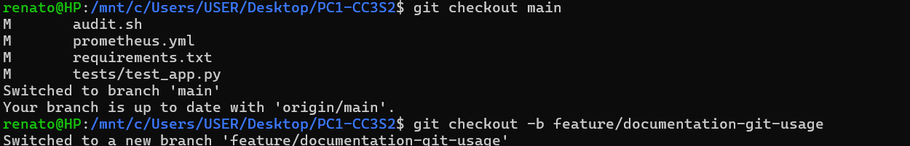
#### 3. Hacer Commits en la Nueva Rama:
Se realiza commits pequeños y significativos a medida que se desarrolla la nueva funcionalidad o la corrección de errores:
```bash
git add .
git commit -m "Se implementa la nueva funcionalidad X"
```
**Foto ejemplo:**
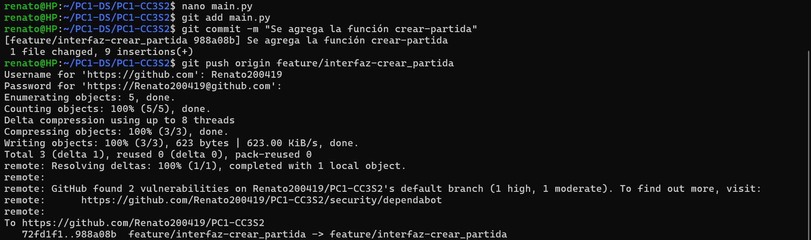
#### 4. Abrir un Pull Request (PR):
- Una vez que la nueva funcionalidad esté lista, abrimos un PR desde la rama que se ha creado hacia main. Y agregamos una descripción breve junto con su título.
- Esto permite que otros miembros del equipo revisen los cambios antes de fusionarlos.
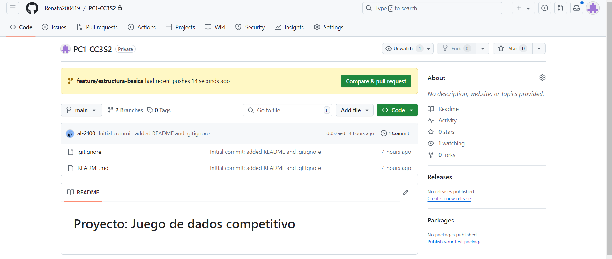
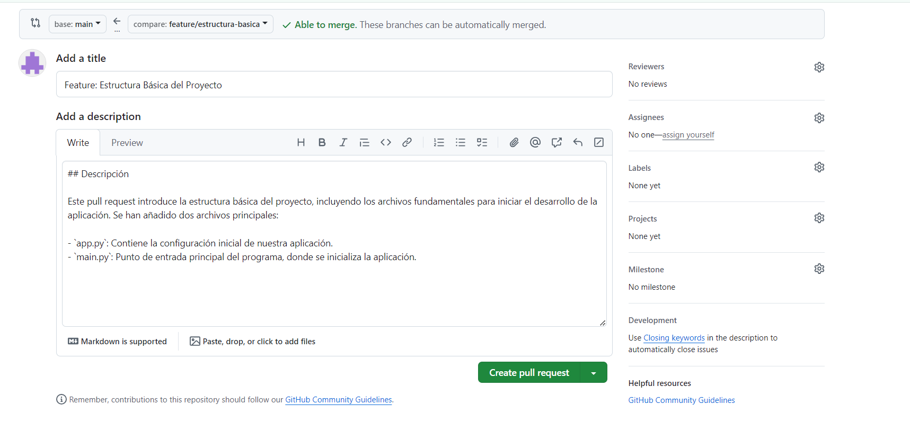

#### 5. Revisión y Fusión (Merge):
- El PR debe ser revisado por al menos un colaborador.
- Después de ser aprobado y si no hay conflictos, el PR se fusiona en main:

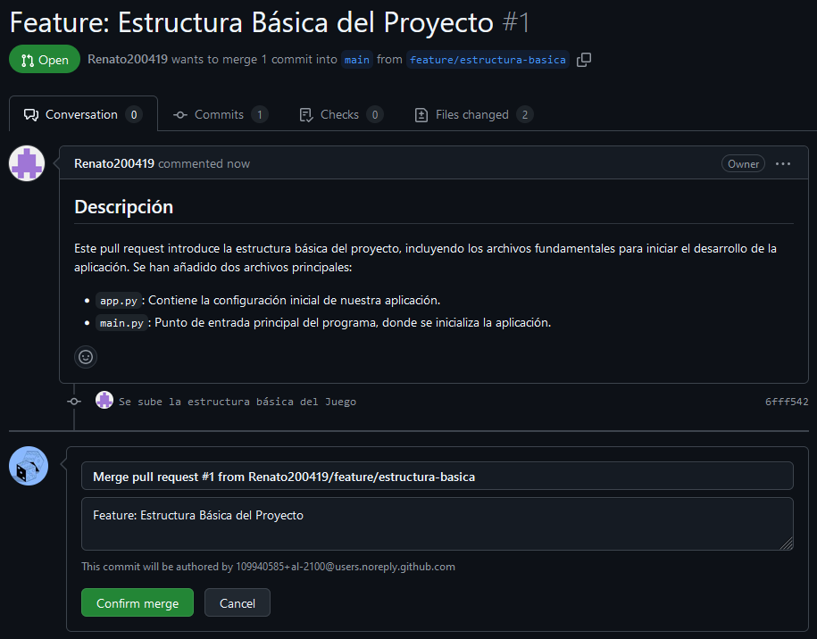

**Resultado Final**
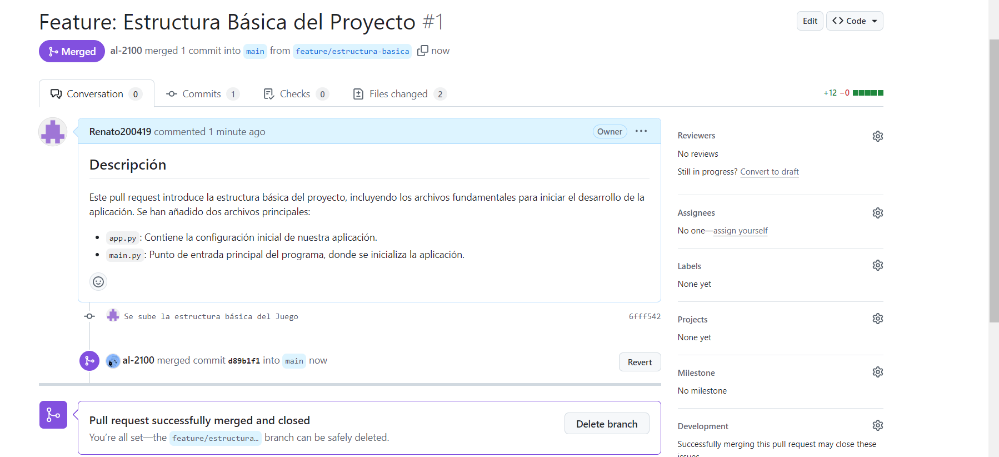

#### 6- Despliegue a Producción:
Como main siempre contiene código listo para producción, cualquier cambio fusionado en `main` puede ser desplegado inmediatamente.


### 2. Gráfico de Red (Network Graph)
El siguiente gráfico muestra cómo se ha desarrollado el proyecto utilizando GitHub Flow, con múltiples ramas de funcionalidad y fusiones (Pull Requests) en la rama main.

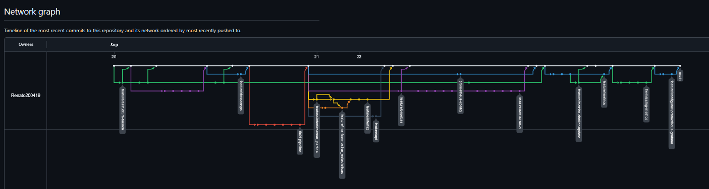

Cada línea representa una rama de funcionalidad o corrección de errores que se desarrolló de manera independiente antes de fusionarse en main.
Los puntos representan commits realizados a lo largo del tiempo, mientras que los bloques de fusión muestran cuándo las ramas fueron fusionadas en main.


### 3. Ventajas de GitHub Flow
GitHub Flow es ideal para este proyecto porque:

- **Flujo ligero**: Es simple y fácil de seguir, adecuado para un ciclo de desarrollo continuo.
- **Despliegue frecuente**: Permite despliegues frecuentes, ya que cualquier cambio en main está listo para producción.
- **Revisión colaborativa**: Los Pull Requests facilitan la colaboración y aseguran que el código sea revisado antes de ser fusionado.

### 4. Resolución de Conflictos usando `git mergetool`
En ocasiones, dos o más desarrolladores pueden trabajar en partes similares del código, lo que provoca conflictos de fusión. Para resolver estos conflictos, se hicieron los siguientes. Primero se mostrará como trabajaron diferentes colaboradores en dos ramas distintas partiendo de una rama principal y se resolverá el conflicto:
**Pasos que se realizaron:**
1. A partir de la rama `main` se creó la rama `feature/interfaz` y luego se crearon dos ramas a partir de esa rama:
2. El colaborador A crea la rama `feature/interfaz-crear_partida` a partir de `feature/interfaz`. Además, realizó cambios como agregar la función `crear_partida` en `main.py`.
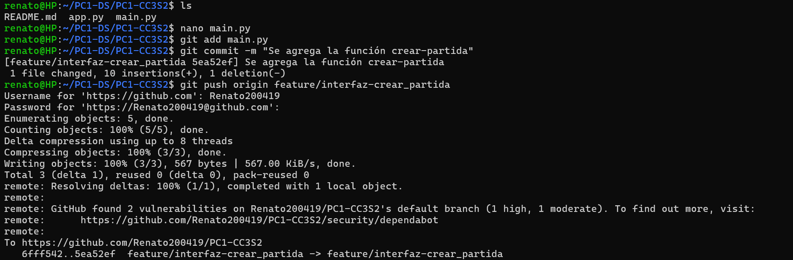
3. El colaborador B crea la rama `feature/interfaz-mostrar_estadisticas` a partir de `feature/interfaz`. Además, realizó cambios como agregar la función `mostrar_estadisticas` en `main.py`.
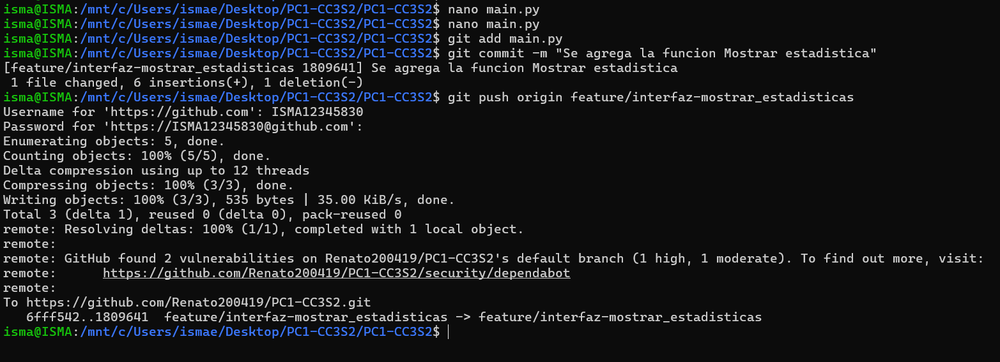
4. Luego de que cada colaborador hace un `git push origin <nombre de la rama respectiva>`. El colaborador A crear un pull request. Agrega un título y breve descripción (en caso sea necesario).
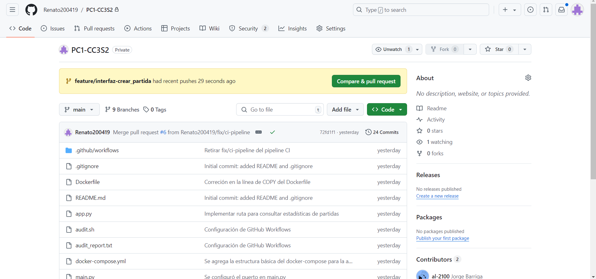

    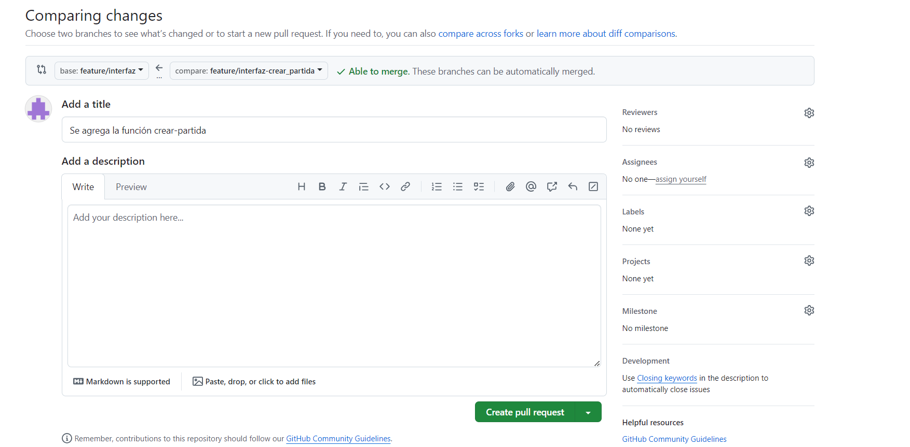
5. El colaborador B acepta el PR y se realiza la fusión.
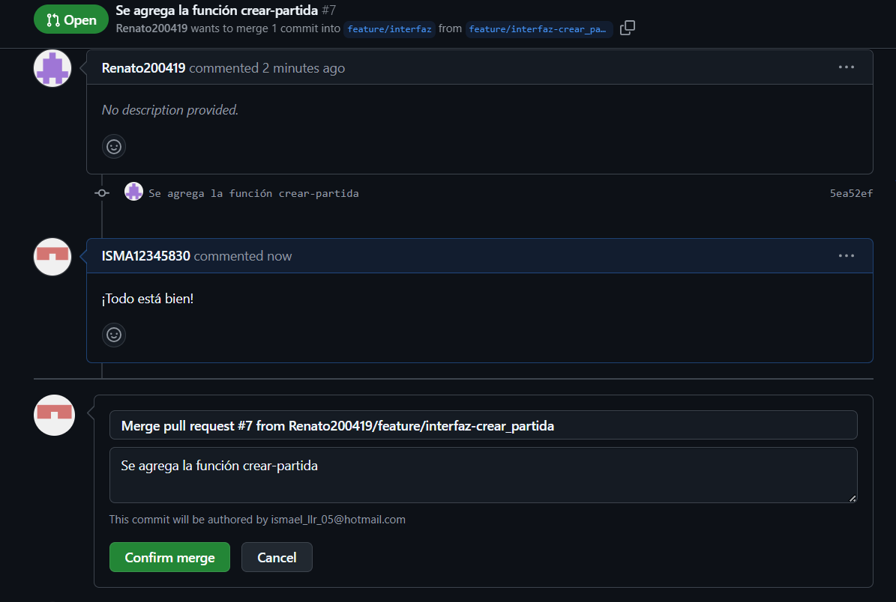

    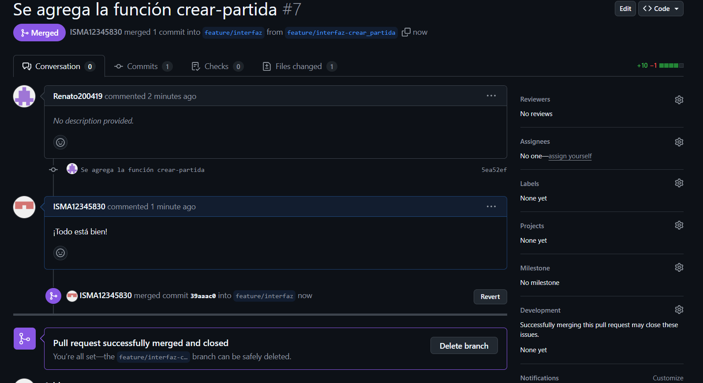
6. Ahora el colaborador B intentará realizar un PR agregando su título y una breve descripción (en caso sea necesario).
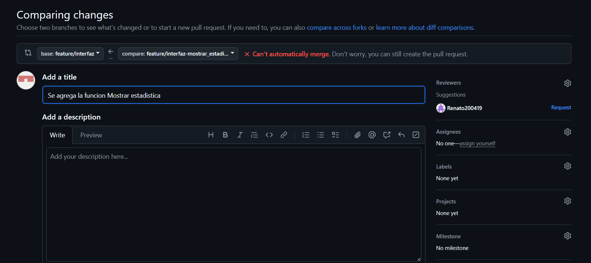
7. El colaborador B se encontrará con este conflicto y tendrá que solucionarlo.
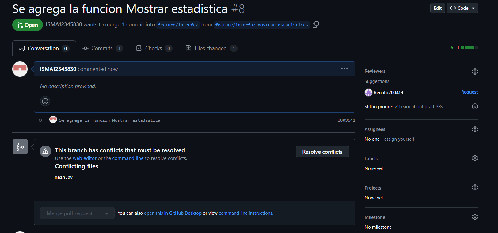
8. El colaborador B actualiza su rama `feature-interfaz` con el comando `git pull origin feature-interfaz ` con los últimos cambios. Y se encontrará con el conflicto.
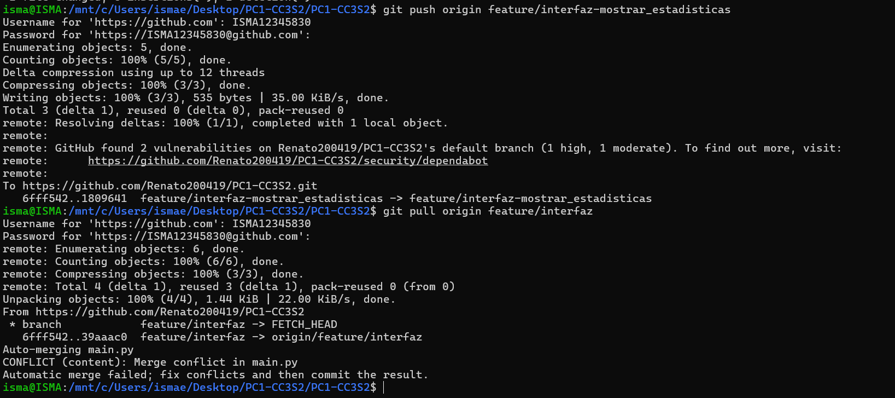
9. Para solucionar usa el comando `git mergetool`que resolverá conflictos de fusión de manera visual con la ayuda de Visual Studio Code.
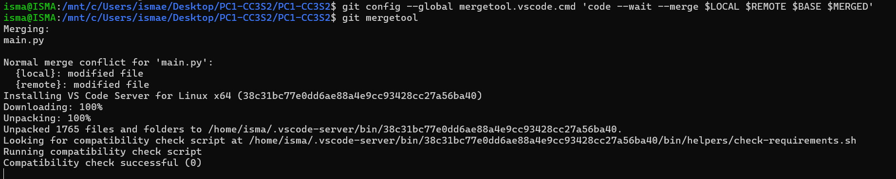
10. El Visual Studio Code se abrirá automáticamente y podrá ver el conflicto:
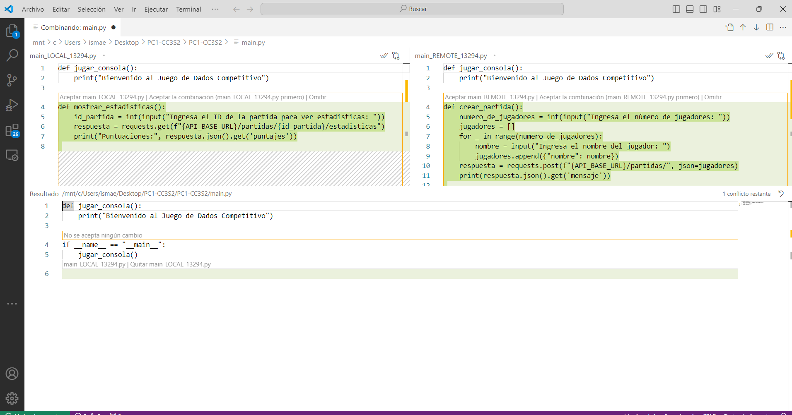
11. El colaborador B soluciona uniendo ambos cambios y eso se hace dando clic en el botón `✔✔` tanto en la izquierda como derecha para aceptar ambos cambios.
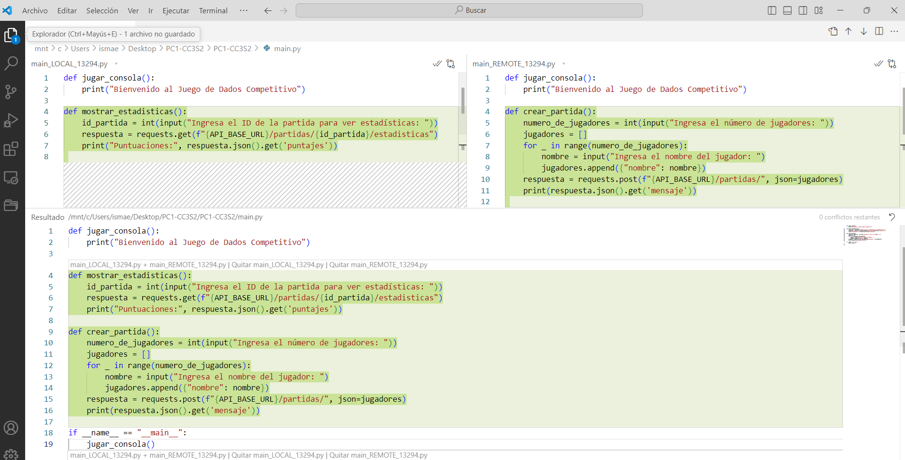
12. Una vez terminado de resolver el conflicto, se realiza el commit y el push.
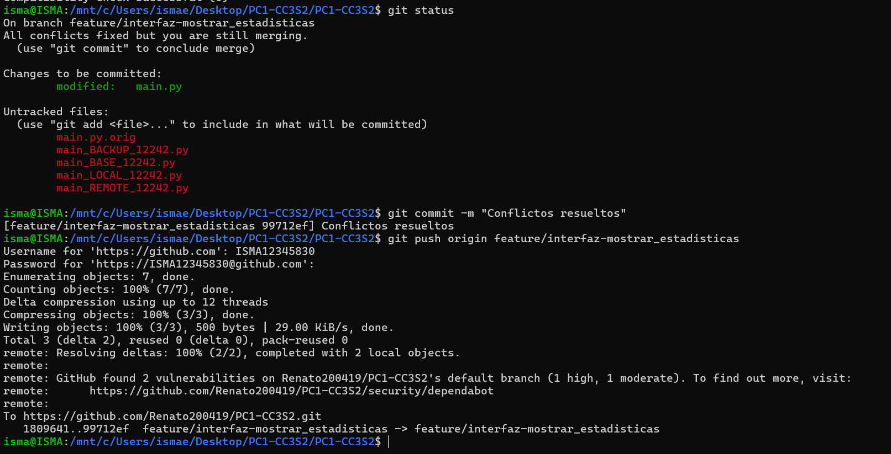
13. Finalmente el colaborador A acepta el PR y se realizaría la fusión con éxito
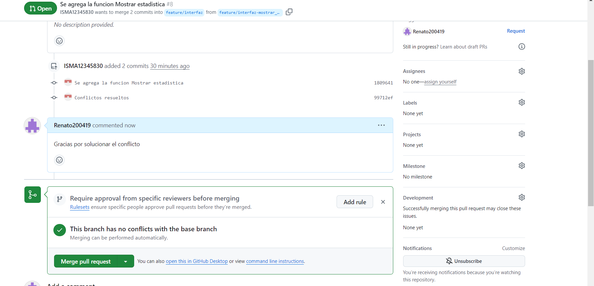
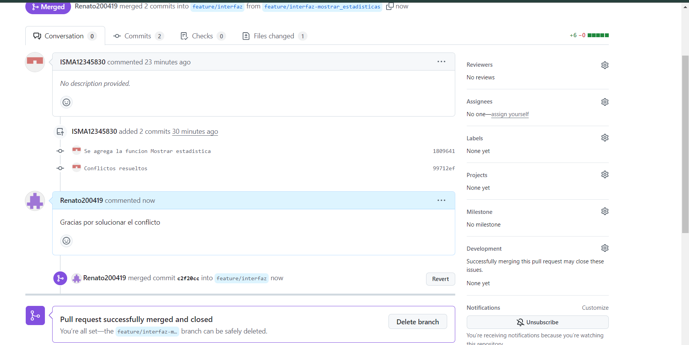

## Uso de cherry-pick
La situación que enfrentamos para utilizar cherry-pick fue la siguiente:

Se creó la rama `feature/metrics` para configurar las métricas de Prometheus, en un momento se vió que era necesario actualizar la forma en la que el Dockerfile instalaba las dependencias, por lo que se creó una rama más a partir de `feature/metrics` llamada `feature/metrics-docker-update`.

Al terminar los cambios en `feature/metrics-docker-update`, se procedió a crear la PR y fusionar.

![[PR17.png]](Imagenes-git/PR17.png)

Aquí tuvimos un error pues la PR solicitaba fusionar `feature/metrics-docker-update` con `main` y al darnos cuenta creamos otra PR haciendo la fusión correcta de `feature/metrics-docker-update` a `feature/metrics` y posterior a ello se fusiona `feature/metrics` con `main`.

![[PR18.png]](Imagenes-git/PR18.png)

![[PR19.png]](Imagenes-git/PR19.png)

Luego de estos PR se procede a revertir el merge de `feature/metrics-docker-update` con `main`. El error se da aquí, pues revertir la PR 17 (la del merge erróneo) luego de aceptar la PR-18 y PR-19 elimina cambios que ya no se incluyen en las últimas PR porque se supone que fueron incluidos antes.

Ahora tenemos la rama main sin varios commits relevantes, una solución rápida que se nos ocurrió es utilizar `cherry-pick` para traer esos cambios a `main`. A continuación la PR que resuelve el problema:

![[PR20.png]](Imagenes-git/PR20.png)

El integrante Olivera se da cuenta de un problema con nuestro Pipeline tras traer estos commits:

![[Problema.png]](Imagenes-git/Problema.png)

El integrante Barriga lee el comentario y tras analizar la causa de que la API no responda, se da cuenta que falta hacer un `cherry-pick` a un commit más. Se hace los cambios y se aprueba la PR ahora que sí funciona.

![[solucion.png]](Imagenes-git/solucion.png)

Con esto nuestro gráfico de las ramas se ve así:

![[branches.png]](Imagenes-git/branches.png)