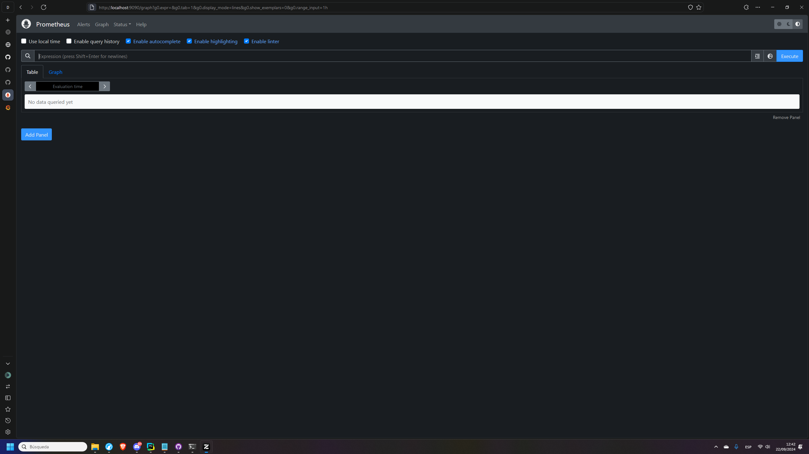
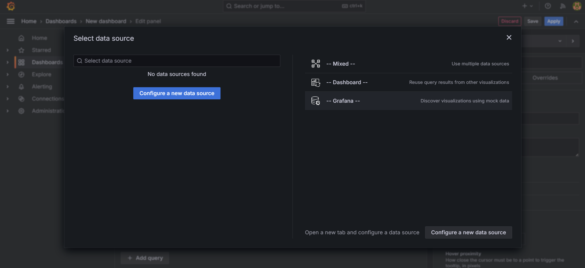
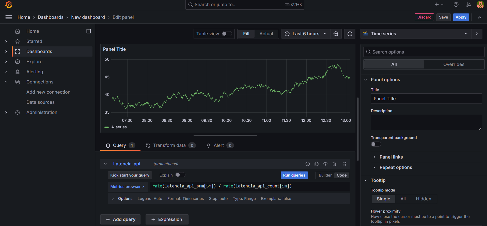
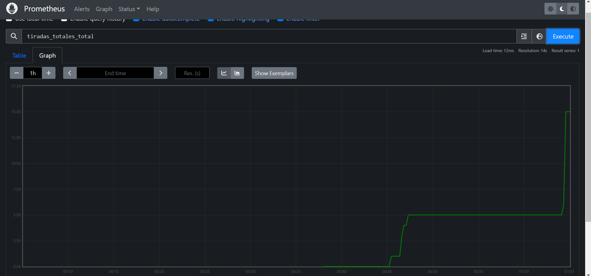
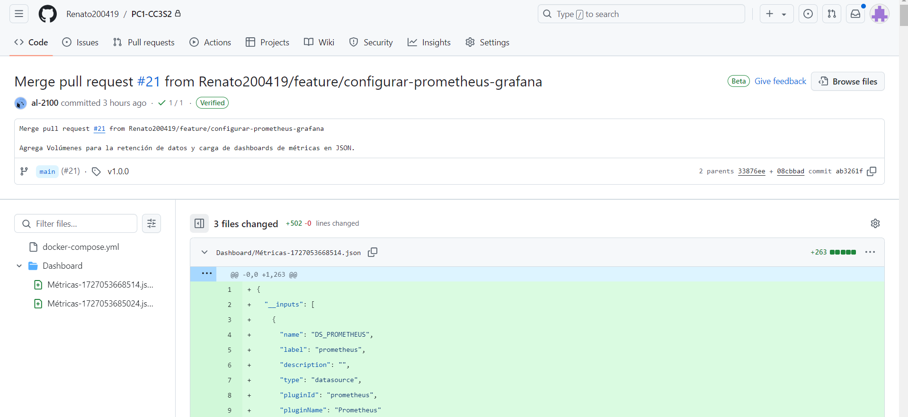

# Configuración de Observabilidad: Prometheus y Grafana
## Introducción
En este proyecto, se utiliza Prometheus para recolectar métricas de la API REST del juego de dados, y Grafana para visualizar esas métricas. La monitorización nos permite rastrear el comportamiento de la API y detectar posibles problemas de rendimiento o errores, como latencia alta o un número inesperado de tiradas de dados.

## Métricas Monitoreadas

Se están monitoreando varias métricas clave del juego de dados y del rendimiento de la API:

### 1. **Métricas Personalizadas**
- **tiradas_totales_total**: Contador que registra el número total de tiradas de dados realizadas en el juego.
- **latencia_api**: Histograma que mide la latencia de las solicitudes a la API REST en segundos.

### 2. **Métricas Estándar (Prometheus FastAPI Instrumentation)**
- **http_requests_total**: Número total de solicitudes HTTP realizadas a la API, desglosadas por método y estado HTTP.
- **process_resident_memory_bytes**: Uso de memoria del proceso.
- **process_cpu_seconds_total**: Tiempo total de CPU consumido por el proceso.

## Configuración de Prometheus

El archivo `prometheus.yml` contiene la configuración para que Prometheus raspe las métricas de la API del juego.

### Archivo `prometheus.yml`:
```yaml
global:
  scrape_interval: 15s  # Frecuencia con la que Prometheus raspa las métricas

scrape_configs:
  - job_name: 'py-app'  # Nombre del trabajo de monitoreo
    static_configs:
      - targets: ['app:8000']  # API del juego ejecutándose en el puerto 8000
```
Para acceder a Prometheus nos dirigimos a [http://localhost:9090](http://localhost:9090).
## Configuración de Grafana

Grafana se utiliza para visualizar las métricas recolectadas por Prometheus. Hemos configurado varios dashboards que muestran información clave sobre la aplicación.

### 1. **Importación de Dashboards**
- Los dashboards preconfigurados están en la carpeta `metrics_dashboards/`.
- Para importar un dashboard en Grafana:
  1. Acceder a Grafana en [http://localhost:3000](http://localhost:3000).
  2. Ir a `Dashboards` > `Manage` > `Import`.
  3. Seleccionar el archivo JSON desde `metrics_dashboards/` y seguir las instrucciones para configurar la fuente de datos.

## Consultas en Grafana

A continuación se muestran algunas consultas comunes que se pueden utilizar en Grafana para visualizar las métricas recolectadas por Prometheus.

### 1. **Tiradas Totales (tiradas_totales_total)**
- Consulta para visualizar el número total de tiradas de dados en el último minuto:
```promql
increase(tiradas_totales_total[1m])
```
### 2. Latencia de la API (latencia_api)
Consulta para ver la latencia promedio de la API:
```promql
rate(latencia_api_sum[1m]) / rate(latencia_api_count[1m])
```
## Pasos que se realizaron en grafana y tambi:
1. Luego de usar el comando: `docker-compose up --build -d`, abrimos el enlace: [http://localhost:3000] y nos logeamos como: `admin` tanto en usuario como contraseña.

2. De igual manera al ingrear link de Prometheus: 

3. Estando en Grafana nos dirigimos a Dashboards y configuramos una nueva `data source` que en este caso sería Prometheus lo configuramos



4. Importamos un dashboard llamado Métricas y luego agregamos un query para el panel: Latencia

5. Luego se duplicó el panel en el cual esta vez lo configuramos llamandolo: Tiradas_totales
 
6. Entonces en main.py se jugaría una partida y se tiraría los dados. Finalmente vemos los cambios
 
 
7. También se pudo visualizar en Prometheus, dando clic en `open metrics explorer` y luego se ejecuta.
 
8. Para finalizar se importó el dashboard y se agregó a la rama.

## Finalización con `pull request` y la aceptación del `merge`
1. Al subir los cambios en la rama, se hace un `Compare & pull request`
2. Se añade un título y una descripción breve.
3. Luego se agrega un comentario avisando que estás esperando la aceptación de los cambios. [optional]
4. Uno de los colaboradores acepta nuestros cambios.

